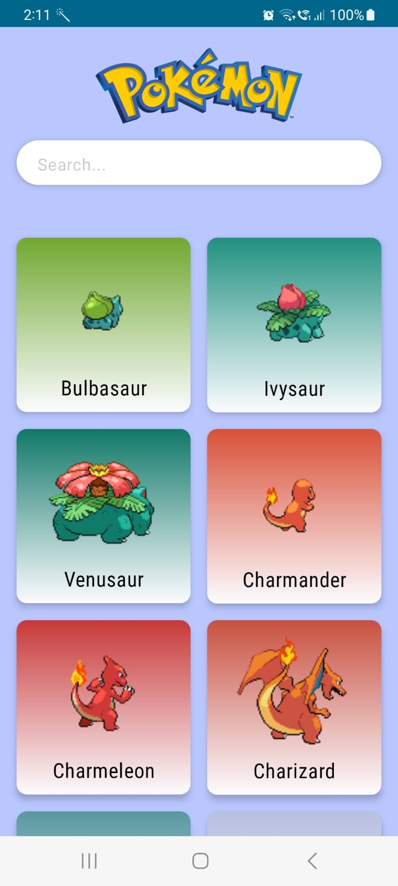
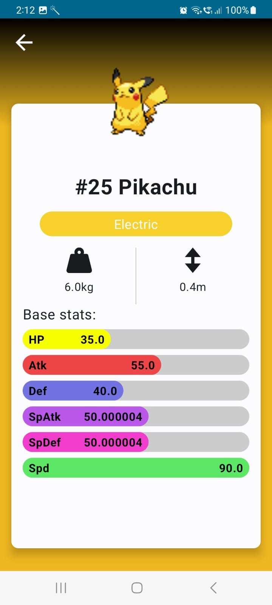
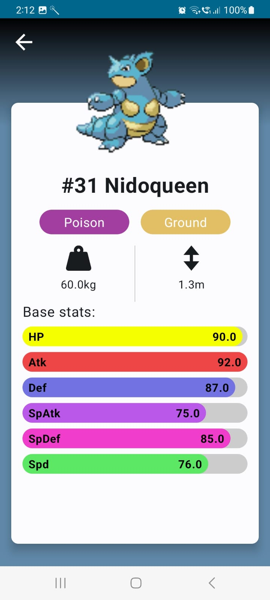

# Jetpack Compose Pokedex App

This is a simple Pokedex app built with Jetpack Compose, displaying a list of Pokemon and allowing users to view details for a particular Pokemon.

## Features

- List of Pokemon: View a list of Pokemon with their names and images.
- Pokemon Details: Select a Pokemon from the list to view detailed information.

## Screenshots

<div align="center">
  
  
  
  
</div>


## Getting Started

### Installation

1. Clone the repository:

   ```bash
   https://github.com/ShiroyaShubham/JetpackComposePokedex.git
